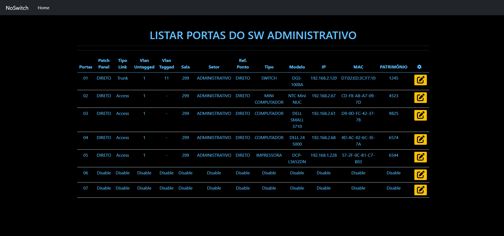

## RELEASE #1.0.6

# [ATENÇÃO]()

## [VERSÃO DE DESENVOLVIMENTO, SOFTWARE NÃO PRONTO, SEM MANUAL DE INSTALAÇÃO. ATENÇÃO: SOFTWARE EM DESENVOLVIMENTO, NENHUM MÓDULO DE SEGURANÇA FOI IMPLEMENTADO AINDA!!!]()

# **NoSwitch**

 O Sistema de Mapeamento de Portas e Cadastro de Switches é uma solução inovadora desenvolvida para simplificar e otimizar a gestão de redes de computadores. O sistema oferece recursos para facilitar a configuração, manutenção e substituição de switches e suas portas de rede.
 
Com o **NoSwitch**, nossa solução inovadora, é possível cadastrar cada porta do switch, facilitando as futuras manutenções. Isso elimina a necessidade de mapear a rede a cada intervenção, pois todas as informações relevantes já estarão registradas no sistema.

O **NoSwitch**, simplifica o processo de gerenciamento de switches ao permitir o cadastro detalhado de cada porta. Com apenas um mapeamento inicial, todas as informações pertinentes são armazenadas de forma organizada e acessível. Dessa forma, quando ocorrer uma manutenção posterior, os técnicos terão acesso imediato aos dados relevantes, agilizando o processo e reduzindo erros.

NoSwitch funções:

* Mapeamento das portas dos switches.
* Cadastramento switch.
* Cadastramento de Portas para cada switch.
* Vizualização das portas dos switch.

## Screenshots

**Sistema de login**

**Menu principal**

**Cadastro de Switches**

**Listar de Switches**

**Mapeamento de portas**

## Pré requisito

* A web server (Apache, Xampp, IIS ou qualquer web server para php.)
* MariaDB >= 10.4.27 ou MySQL >= 8.0.25
* PHP ( Versão >= 8.0.25)

   
## Suporte

Não oferecemos suporte para o sistema **NoSwitch**, o que significa que os usuários são responsáveis por lidar com a instalação, configuração e solução de problemas por conta própria.

Se você encontrar algum problema com o sistema, agradecemos se puder enviar feedback detalhado. Por favor, inclua possíveis bugs, enviando capturas de tela ou vídeos que demonstrem o problema e como ele ocorre. Esteja ciente de que os bugs serão corrigidos ao longo do tempo, tendo em mente que o desenvolvimento é feito por apenas uma pessoa que deseja resolver um problema e compartilhar essa solução com todos.
